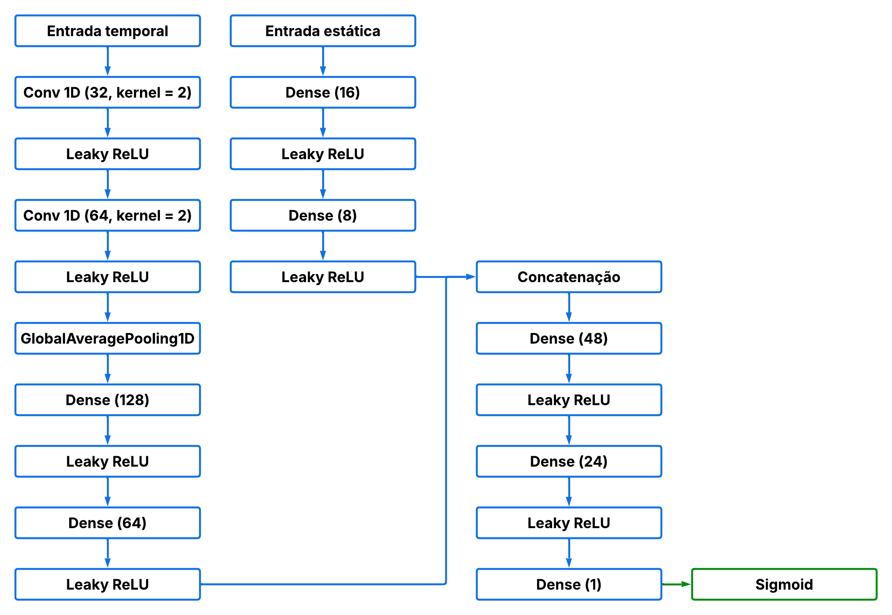
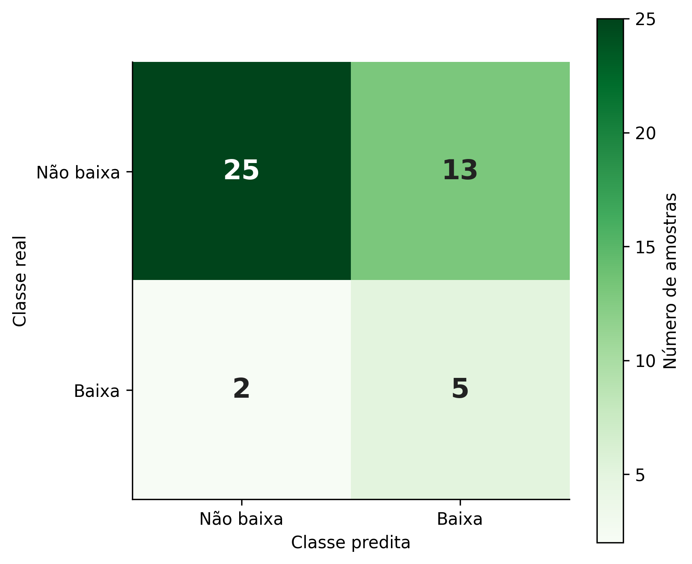

<div align="center">

# Detecção de Baixa Produtividade da Soja Utilizando Sensoriamento Remoto e Aprendizado Profundo

---

[]()
[]()
[]()
[]()
[]()

---

</div>

<div align="left">

## Introdução

Este projeto apresenta a documentação pública do Trabalho de Conclusão de Curso **"Detecção de Baixa Produtividade da Soja Utilizando Sensoriamento Remoto e Aprendizado Profundo"**, desenvolvido no curso de Engenharia de Computação da Universidade Tecnológica Federal do Paraná (UTFPR).

O objetivo do trabalho foi desenvolver e avaliar uma metodologia baseada em sensoriamento remoto, dados climáticos, atributos de solo e aprendizado profundo para estimar a probabilidade de uma área de soja apresentar **baixa produtividade** ou **produtividade não baixa**.

A proposta foi formulada como uma tarefa de **classificação binária**, considerando como baixa produtividade valores menores ou iguais a **3000 kg/ha**, equivalente a 50 sacas por hectare.

## Visão Geral

A produtividade da soja pode variar significativamente entre áreas agrícolas devido a fatores climáticos, espectrais, edáficos e de manejo. Mesmo dentro de um mesmo município, diferentes propriedades podem apresentar comportamentos produtivos distintos.

Neste projeto, foram integradas diferentes fontes de dados para representar o desenvolvimento da lavoura, as condições ambientais e as características do solo. A metodologia buscou aproximar dados públicos em escala municipal de uma aplicação mais próxima da escala de propriedade rural.

## Fontes de Dados

As principais fontes utilizadas na metodologia foram:

| Fonte          | Informação Utilizada                                 | Finalidade                                |
| -------------- | ---------------------------------------------------- | ----------------------------------------- |
| SIDRA/IBGE     | Produtividade municipal da soja                      | Construção da base municipal              |
| IBGE           | Limites territoriais municipais                      | Delimitação espacial dos municípios       |
| IDR-Paraná     | Coordenadas, área plantada e produtividade observada | Construção da base de propriedades rurais |
| CAR            | Polígonos de imóveis rurais                          | Associação espacial das amostras          |
| Sentinel-2     | Imagens ópticas multiespectrais                      | Extração de índices vegetativos           |
| ERA5-Land      | Variáveis climáticas diárias                         | Agregação mensal das condições climáticas |
| MapBiomas      | Classe de soja                                       | Identificação das áreas de soja           |
| MapBiomas Solo | Atributos edáficos                                   | Representação das características do solo |

## Metodologia

A metodologia foi organizada em três etapas principais:

1. **Construção das bases de dados**

   Foram construídas duas bases: uma base municipal, utilizada como principal fonte de treinamento, e uma base em escala de propriedade rural, utilizada para calibração, seleção de configurações e validação final.

2. **Extração e organização dos atributos**

   Foram extraídos atributos vegetativos, climáticos e de solo. Os atributos temporais foram organizados nos meses de outubro, novembro e dezembro, permitindo uma análise antecipada da safra.

3. **Treinamento e avaliação do modelo**

   Foi utilizada uma rede neural profunda para classificar as amostras entre baixa produtividade e produtividade não baixa. Diferentes configurações de entrada foram avaliadas, considerando combinações de índices vegetativos, variáveis climáticas e atributos de solo.

## Atributos Utilizados

Os atributos avaliados foram organizados em três grupos principais:

### Índices Vegetativos

* NDVI
* NDRE
* NDMI
* EVI

### Variáveis Climáticas

* Temperatura máxima
* Temperatura mínima
* Precipitação acumulada
* Radiação solar acumulada

### Atributos de Solo

* Teor de argila
* Teor de areia
* Carbono orgânico do solo

## Arquitetura Geral

O modelo recebeu como entrada atributos temporais e estáticos relacionados às áreas de soja analisadas.

Os atributos temporais representaram a evolução da lavoura e das condições climáticas durante os meses iniciais da safra. Já os atributos estáticos representaram características do solo associadas ao ambiente produtivo.

<div align="center">



</div>

## Resultados

O modelo final foi avaliado em um subconjunto de validação mantido isolado durante o desenvolvimento.

As principais métricas utilizadas foram:

| Métrica                  |  Valor |
| ------------------------ | -----: |
| Acurácia balanceada      | 0,6861 |
| AUC                      | 0,7782 |
| Recall da classe baixa   | 0,7143 |
| Precisão da classe baixa | 0,2778 |
| F1-score da classe baixa | 0,4000 |

Os resultados indicaram que a abordagem possui potencial para sinalização preliminar de áreas com maior risco de baixa produtividade. O modelo apresentou maior capacidade de recuperar amostras da classe de baixa produtividade do que precisão nas previsões positivas, o que reforça seu uso como ferramenta de triagem e apoio à análise agrícola.

<div align="center">




</div>

## Limitações

A principal limitação do trabalho está relacionada à escassez de dados observados em escala de propriedade rural.

Como a validação final possui poucas amostras da classe de baixa produtividade, as métricas ficam sensíveis a pequenas variações nos acertos e erros do modelo. Dessa forma, os resultados devem ser interpretados como uma avaliação inicial da metodologia, e não como uma solução definitiva para estimativa de produtividade em escala operacional.

## Estrutura do Repositório

```text
Deteccao-De-Baixa-Produtividade-Da-Soja-Utilizando-Sensoriamento-Remoto-E-Aprendizado-Profundo
├── README.md
├── LICENSE
└── assets
    ├── arquitetura-modelo.png
    ├── metodologia.png
    ├── matriz-confusao.png
    └── resultados.png
```

## Observação

Este repositório não contém código-fonte, dados brutos, coordenadas de propriedades, polígonos rurais, modelos treinados ou o arquivo PDF completo do trabalho.

O objetivo é apenas apresentar publicamente a visão geral, a metodologia e os principais resultados do projeto.

## Autor

**Vinicius Pereira Tavares de Sousa**
Engenharia de Computação
Universidade Tecnológica Federal do Paraná — UTFPR

## Licença

Este repositório está licenciado sob a licença **CC BY 4.0**. Consulte o arquivo `LICENSE` para mais detalhes.

</div>
